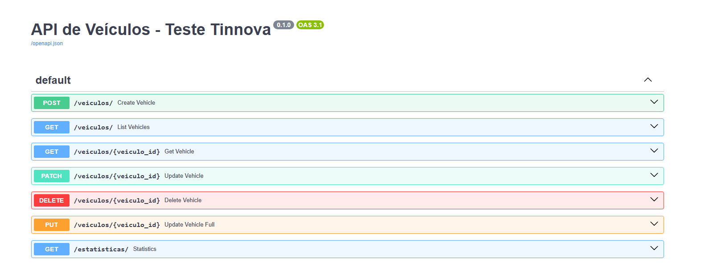

# Tinnova Test Challenge - Exercises 1 to 5

This repository contains the solutions for the Tinnova technical challenge, covering five exercises:

- Exercise 1: Vote Percentage Calculation
- Exercise 2: Bubble Sort Algorithm
- Exercise 3: Factorial Calculator
- Exercise 4: Sum of Multiples of 3 or 5
- Exercise 5: Vehicle Management API (CRUD + Statistics)

## 📂 Project Structure

- `exercise_1/ to exercise_4/`: Simple Python scripts for algorithm exercises.
- `exercise_5/`: Complete FastAPI application for vehicle management.
- `tests/`: Unit tests for the algorithms.
- `exercise_5/tests/`: Unit tests for the API.

## 🚀 How to Run the Algorithms (Exercises 1-4)

Each algorithm can be executed individually:

```bash
python exercise_X/your_file.py

EX.
python exercise_3/factorial_calculator.py
```

## 🛠️  How to Run the API (Exercise 5)

1. Create and activate a virtual environment:

```bash
python -m venv venv

venv\Scripts\activate  # On Windows
```
or

```bash
source venv/bin/activate  # On Linux/macOS
```

2. Install dependencies:

```bash
pip install -r requirements.txt
```

3. Start the server:

```bash
python -m uvicorn app.main:app --reload --app-dir exercise_5/
```

4. Access the API documentation (Swagger):

http://127.0.0.1:8000/docs



## 📜 API Business Rules

The Vehicle Management API allows:

  - Registering vehicles.
  - Listing all vehicles with optional filters (brand, color, year).
  - Updating vehicles (partial and full update).
  - Deleting vehicles.
  - Viewing statistics:

    - Vehicles not sold.
    - Vehicles registered in the last 7 days.
    - Vehicles grouped by decade.
    - Vehicles grouped by brand.

# 🔎 Validations

    - Brand Validation: Only known brands are accepted when creating or updating a vehicle.  
    If an invalid brand is provided, the API will return a `400 Bad Request` with a clear error message.

    - Full Update (PUT) Validation:  
    When performing a full update, all required fields must be provided.  
    If any required field is missing, the API will return a `422 Unprocessable Entity` indicating the missing data with a custom message

    - Partial Update (PATCH) Validation:  
    Only the fields provided will be updated.  
    If the brand is updated, it must pass brand validation.

    - Not Found Handling:  
    If a vehicle with the specified ID does not exist during retrieval, update, or deletion,  
    the API will return a `404 Not Found` with a descriptive error message.


## 📈 Test Coverage Guarantee

The entire project is covered by unit tests, achieving 100% code coverage across:

- The Vehicle Management API (Exercise 5)
- All core algorithms (Exercises 1 to 4)

Tests were designed to cover:

- Success flows (e.g., creating, updating, listing, and deleting vehicles)
- Error handling (e.g., invalid brand validation, missing required fields, non-existing vehicle operations)
- Business rules (e.g., filters, statistics calculation)

Coverage includes both happy paths and edge cases, ensuring robust and reliable behavior throughout the application.

Coverage was measured using [`coverage`](https://coverage.readthedocs.io/en/latest/) and verified by badge generation.


## 🧪 Running Tests and Coverage

```bash
python -m coverage run -m pytest
python -m coverage report -m
```


# ✅ Requirements:

    Python 3.11+

    Pip